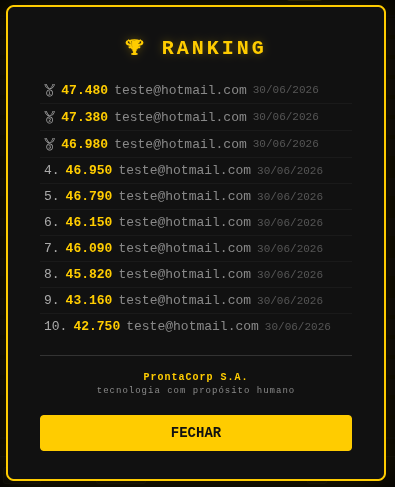

# 🟡 Pac-Man Retrô v3.0


> Uma aplicação web completa do clássico jogo Pac-Man, com backend em **Python 3.13 + FastAPI**, frontend em **HTML5 Canvas puro**, sons **sintetizados via Web Audio API**, **4 fantasmas com IA clássica progressiva por tiers**, **sistema de combos**, **joystick virtual suave (Touch Delta)**, **PWA instalável**, **auth passwordless (Privacy by Design)**, **15 testes de movimento** e **Dockerizado** para deploy rápido.

---

## 📋 Índice

- [Roadmap de Versões](#roadmap-de-versões)
- [Arquitetura](#arquitetura)
- [Funcionalidades](#funcionalidades)
- [Galeria](#galeria)
- [Changelog Detalhado](#changelog-detalhado)
- [Pré-requisitos](#pré-requisitos)
- [Instalação e Execução](#instalação-e-execução)
- [Estrutura de Arquivos](#estrutura-de-arquivos)
- [API REST](#api-rest)
- [Segurança](#segurança)
- [Mecânica do Jogo](#mecânica-do-jogo)
- [IA dos Fantasmas (Tier System)](#ia-dos-fantasmas-tier-system)
- [Input Buffering (FIX v3.0)](#input-buffering-fix-v30)
- [Virtual Joystick](#virtual-joystick)
- [Sons Sintetizados](#sons-sintetizados)
- [Sistema de Configurações](#sistema-de-configurações)
- [PWA e Deploy Mobile](#pwa-e-deploy-mobile)
- [Dockerização](#dockerização)
- [Variáveis de Ambiente](#variáveis-de-ambiente)
- [Testes](#testes)
- [Licença](#licença)

---

## Roadmap de Versões

```
v0.9 (Beta)          v1.0 (Funcional)             v2.0                         v2.2 (Polish)               v3.0 (Arquitetura)
  │                      │                            │                           │                            │
  ├─ 2 fantasmas         ├─ 4 fantasmas + IA          ├─ Sistema de combo         ├─ Fluidez de movimento 90°  ├─ 🐍 Python/FastAPI
  ├─ Movimento básico    ├─ FIX 1: Target-based       ├─ Menu de configurações    ├─ Fantasmas 3/4 saem da casa├─ 🔐 Auth Passwordless
  ├─ 100 linhas IA       ├─ FIX 2: Buffer de input    ├─ Controles mobile (D-pad) ├─ Frutas por tempo (30s)    ├─ 🎮 Input Buffering Fix
  ├─ Sem save            ├─ FIX 3: Ghost house        ├─ Efeitos visuais por tier ├─ Salvamento automático     ├─ 🕹️ Virtual Joystick
  ├─ Sem frutas          ├─ Scatter/Chase cycle       ├─ Tela de pausa aprimorada ├─ Botão Continue mobile     ├─ 📱 PWA + Service Worker
  └─ 2 sons              ├─ 4 fantasmas completos     ├─ Combo de score           ├─ Efeitos de fruta (spawn+eat)├─ ✅ 15 testes movimento
                         ├─ Sistema de frutas         ├─ Dificuldade ajustável    ├─ Ranking modal + créditos   └─ 🐳 Docker Python
                         ├─ Save/resume (localStorage)├─ Intro tier-based          └─ v2.1: Mute + keyboard hints
                         ├─ Progressão de nível       ├─ 14+ sons sintetizados
                         ├─ High score + celebração   └─ Leaderboard na pausa
                         └─ 10+ sons sintetizados
```

---

## Arquitetura

```
┌─────────────────────────────────────────────────────────┐
│                     Navegador                           │
│  ┌───────────┐   ┌────────────┐   ┌──────────────────┐  │
│  │ index.html│   │  game.js   │   │ Web Audio API    │  │
│  │ (Auth)    │   │  (Motor)   │   │ (14+ efeitos)    │  │
│  │ (Joystick)│   │  (~3000L)  │   │                  │  │
│  │ (Settings)│   │  Entity    │   │                  │  │
│  └───────────┘   │  Game      │   └──────────────────┘  │
│         │        │  Ghost IA  │                         │
│         │        │  Joystick  │                         │
│         │        └────────────┘                         │
│         │               │                               │
│         └───────┬───────┘                               │
│                 │ fetch() + Bearer Token                │
└─────────────────┼───────────────────────────────────────┘
                  │
                  ▼
┌─────────────────────────────────────────────────────────┐
│              Python 3.13 + FastAPI (uvicorn)             │
│  ┌────────────┐   ┌──────────────┐   ┌────────────────┐  │
│  │  main.py   │   │  models.py   │   │   schemas.py   │  │
│  │  (REST)    │   │  (SQLite)    │   │  (Pydantic)    │  │
│  │  /api/*    │   │  WAL mode    │   │  validação     │  │
│  └────────────┘   └──────┬───────┘   └────────────────┘  │
│                           │                              │
│                           ▼                              │
│                  ┌────────────────┐                      │
│                  │   SQLite DB    │                      │
│                  │  data/pacman.db│                      │
│                  │ players        │                      │
│                  │ sessions       │                      │
│                  │ scores         │                      │
│                  └────────────────┘                      │
└─────────────────────────────────────────────────────────┘
```

### Stack

| Camada    | Tecnologia                          | Função                         |
|-----------|-------------------------------------|--------------------------------|
| Frontend  | HTML5 + Canvas API + JS puro        | Jogo, sons, UI, Joystick Touch |
| Backend   | Python 3.13+ + FastAPI + uvicorn    | API REST                       |
| Banco     | SQLite (sqlite3, WAL mode)          | Persistência local             |
| Auth      | Passwordless (apenas email)         | Tokens de sessão (32B hex)     |
| Sessão    | secrets.token_hex(32)               | Autenticação stateless         |
| Config    | localStorage                        | Settings, save/resume          |
| Joystick  | Web Touch API (Touch Delta)         | Controle mobile suave          |
| PWA       | manifest.json + sw.js               | Instalação mobile              |
| Contêiner | Docker Python 3.13-slim             | Empacotamento leve             |
| Testes    | pytest (backend) + jsdom (frontend) | Validação automatizada         |

---

## Funcionalidades

### 🎮 Jogo

- **Pac-Man clássico** controlado por setas do teclado ou joystick virtual (touch)
- **Input Buffering preciso v3.0** — fila de comandos com consumo no alinhamento exato ao centro do tile
- **Early snap** — direção aplicada antecipadamente quando dentro de 10px do centro do tile
- **4 fantasmas** com IA clássica por tiers: Blinky, Pinky, Inky, Clyde — todos saem da casa corretamente
- **Ciclo Scatter/Chase** com timings progressivos por nível (reduzidos em tiers altos)
- **Sistema de frutas** — 6 frutas (🍒🍓🍎🍉🍈🚀) com spawn a cada 30s em posições aleatórias sobre pastilhas, power-ups (Speed, Shield)
- **Efeitos visuais de fruta** — brilho/pulso com partículas ao aparecer; explosão radial ao ser comida
- **Power pellets** — ativam modo fright (fantasmas azuis e vulneráveis)
- **Túneis** — wrap-around horizontal nas bordas do mapa com velocidade reduzida
- **Mapa 21×21** com ghost house, portas e corredores de saída
- **Sistema de combos** — multiplicador de score por ações em sequência (ghosts + frutas), janela de 3s
- **Progressão de nível** — velocidade, IA e visual aumentam a cada fase (10+ níveis)
- **Save/Resume** — auto-save ao morrer, Continue/Restart no GAMEOVER, detecção no login
- **High Score** — submissão autenticada via API, tela de celebração com confete
- **Créditos** — "ProntaCorp S.A. — tecnologia com propósito humano" no topo da tela

### 🏆 Sistema de Combo

- Ação em sequência (ghost ou fruta) em janela de 3 segundos
- Multiplicador progressivo: x1.0 → x1.5 → x2.0 → x2.5 → ...
- Stacking com a escalação clássica de fantasmas (200 × 2ⁿ × combo)
- Display visual: "COMBO xN.N" no canto + barra de tempo amarela
- Som de combo com pitch crescente

### ⚙️ Menu de Configurações

- **Toggle de Intro** — habilita/desabilita animação de abertura
- **Toggle de Som** — mute/unmute de todos os efeitos sonoros
- **Botão de mute rápido** 🔊/🔇 no header (sincronizado com o toggle das configurações)
- **3 níveis de dificuldade**: Fácil (0.7×), Normal (1.0×), Difícil (1.3×)
- Configurações persistem em localStorage entre sessões
- Pausa automática ao abrir, resume ao fechar

### 📱 Virtual Joystick (Touch Delta)

- Joystick dinâmico baseado na Web Touch API — primeiro toque define o centro
- Arrasto calcula delta X/Y, normalizado para direções discretas (Cima/Baixo/Esquerda/Direita)
- Deadzone de 8px para evitar inputs fantasmas
- **Long-press (500ms)** para pausar | **Tap curto (<200ms)** pausa durante PLAYING
- Botão ❚❚ de pause no header (visível apenas em mobile)
- Botão ▶ Continue no Game Over quando há save disponível
- D-pad antigo removido — substituído pelo joystick suave

### 👻 Efeitos Visuais por Tier

| Tier | Nível   | Efeitos |
|------|---------|---------|
| 1    | 1       | Fantasmas clássicos (sem extras) |
| 2    | 2-3     | Brilho sutil no corpo (glow aura) |
| 3    | 4-6     | Sombra pulsante, olhos com glow azul, brilho no corpo |
| 4    | 7+      | Olhos vermelhos pulsantes, afterimage (trail), glow intenso, flash na intro |

### 🎵 Áudio (Web Audio API — 14+ sons)

Todos os sons são gerados em tempo real pela Web Audio API, sem arquivos externos.

| Efeito          | Oscilador | Frequência              | Duração   | Onde toca              |
|-----------------|-----------|-------------------------|-----------|------------------------|
| Chomp           | Square    | 320 → 480 Hz            | 60 ms     | Comer pastilha         |
| Power pellet    | Sawtooth  | 180 → 680 Hz            | 350 ms    | Comer power pellet     |
| Eat ghost       | Square    | 700 → 1100 Hz           | 200 ms    | Comer fantasma (fright)|
| Eat fruit       | Sine      | 520 → 1040 Hz           | 240 ms    | Comer fruta            |
| Death           | Sawtooth  | 520 → 40 Hz             | 1.0 s     | Pac-Man morre          |
| Game start      | Square    | 260, 330, 390, 520      | 720 ms    | Iniciar jogo           |
| Level complete  | Square    | 6 notas ascendentes     | 660 ms    | Completar nível        |
| Ready           | Triangle  | 440, 550, 660           | 300 ms    | Tela READY             |
| Mode switch     | Sine      | 330, 440                | 140 ms    | Scatter ↔ Chase        |
| Intro           | Square    | 6 notas ascendentes     | 900 ms    | Animação de abertura   |
| Celebrate       | Square    | 8 notas + brilhantes    | 1.5 s     | High score             |
| Combo           | Square    | Pitch por nível         | 150 ms    | Combo multiplier       |
| Power-up        | Square    | 5 notas ascendentes     | 350 ms    | Ativar power-up        |

### 🔐 Autenticação Passwordless (Privacy by Design)

- **Login e registro sem senha** — apenas email como identificador único
- **Nenhum dado sensível armazenado** — conformidade com Privacy by Design (LGPD)
- **Tokens de sessão** (32 bytes hex) em tabela separada com `player_id`
- **Logout** remove token do banco
- **Sanitização** de inputs (limite 255 chars, remoção de XSS)

### 🏅 Pause Screen Aprimorada

- Overlay canvas-renderizado com fundo escuro
- Stats ao vivo: Score, Nível, Vidas, Combo, Dots comidos/total
- Mini leaderboard: top 5 scores da API com medalhas (🥇🥈🥉)
- Destaque do score atual em dourado
- Fetch assíncrono de scores ao pausar

---

## Galeria

Capturas de tela do jogo em diferentes estados. Para gerar as screenshots, execute o servidor e utilize o script `scripts/capture-screenshots.js`.

### 🎬 Intro Animation


> Animação de abertura com título "PAC-MAN", Pac-Man comendo dots e fantasmas descendo. O visual varia por tier: partículas (tier 3+), screen shake (tier 4).

### 🎮 Gameplay


> Jogo em ação: Pac-Man navegando pelo labirinto, 4 fantasmas com IA ativa, pastilhas, power pellets e frutas visíveis. HUD mostra score, vidas e nível.

### ⏸️ Pause Screen


> Pausa canvas-renderizada com stats ao vivo (Score, Nível, Vidas, Combo, Dots) e mini leaderboard com top 5 scores da API.

### ⚙️ Settings Modal


> Menu de configurações: toggles de Intro e Som, seletor de dificuldade (Fácil/Normal/Difícil), close button.

### 📱 Virtual Joystick


> Joystick virtual suave baseado em Touch Delta. Primeiro toque define o centro, arrasto calcula direção. Long-press e tap para pausar.

### 👻 Ghost Visual Tiers

| Tier 1 (Nível 1) | Tier 2 (Nível 2-3) | Tier 3 (Nível 4-6) | Tier 4 (Nível 7+) |
|---|---|---|---|
|  |  |  |  |
| Clássico | Glow sutil | Sombra + olhos glow | Trail + olhos vermelhos |

> Efeitos visuais progridem por tier: glow aura (tier 2+), sombra pulsante e olhos azuis (tier 3), afterimage e olhos vermelhos pulsantes (tier 4).

### 🏆 Passagem de Nível


> Tela de transição entre níveis com stats: pontuação atual, vidas restantes e fantasmas decorativos.

### 💀 Game Over


> Tela de Game Over com opções de continuar (C) ou reiniciar (N).

### 🏆 Ranking



> Tela com as 10 melhores pontuações registradas via API.

---

## Changelog Detalhado

### 🏷️ v3.0 — Arquitetura Python/FastAPI + Input Buffering + PWA

**Mudanças Arquiteturais:**
- Backend migrado de Node.js/Express para **Python 3.13+ com FastAPI + uvicorn**
- Autenticação **passwordless** — login apenas por email (Privacy by Design)
- Porta padrão alterada de **3000 → 8000**
- Dockerfile e docker-compose.yml atualizados para Python

**Input Buffering (FIX Crítico):**
- `TILE_CENTER_THRESHOLD=2px` para consumo preciso do buffer no centro do tile
- `checkAndApplyBuffer()` consumido a cada frame no `step()` da entidade
- **Early snap** restaurado com `TURN_TOLERANCE=10px`
- Meias-voltas instantâneas mantidas

**Virtual Joystick:**
- D-pad removido, substituído por joystick dinâmico baseado em Touch Delta
- Deadzone de 8px, direções discretas normalizadas do vetor contínuo
- Long-press (500ms) e tap curto (<200ms) para pausar
- Botão ❚❚ no header (não mais sobre o mapa)

**PWA:**
- manifest.json com display standalone, ícones 192×192 e 512×512
- Service Worker com estratégia Network First
- Ícones profissionais com design Pac-Man

**Testes:**
- 11 testes pytest (backend): auth, scores, email uniqueness, health
- 15 testes de movimento (Node.js + jsdom): buffer, early snap, meia-volta, bloqueio

**Correções:**
- Botão de pause movido do overlay do mapa para o header
- Sync de volume bidirecional (toggle configurações ↔ botão mute)
- `handlePause()` não definida causava ReferenceError no mobile

### 🏷️ v2.2 — Polimento e Correções Críticas

**Correções de bugs:**
- **Fluidez de movimento 90°** — `TURN_TOLERANCE` aumentado para 10px; detecção antecipada de cruzamento
- **Fantasmas 3 e 4 saindo da casa** — navega horizontalmente até coluna 10 antes de subir
- **Sistema de frutas** — timer de 30 segundos, spawn aleatório sobre pastilhas, ciclo infinito, ordem progressiva
- **Salvamento automático** — auto-save ao morrer, Continue/Restart no GAMEOVER, detecção no login

**Novas funcionalidades:**
- **Efeitos visuais de fruta** — brilho/pulso com partículas ao aparecer; explosão radial ao comer
- **Botão Continue mobile** — botão verde "▶ CONT" no GAMEOVER com save
- **Tela de créditos** — "© ProntaCorp S.A." no estado IDLE
- **Frutas reordenadas** — 🍒→🍓→🍎→🍉→🍈→🚀 (cereja, morango, maçã, melancia, melão, foguete)

### 🏷️ v2.1 — Bug Fixes, Mute Button, Keyboard Hints

**Correções e melhorias:**
- Botão 🔊/🔇 de mute rápido no header + atalho M
- Seção de dicas de teclado no HTML
- Teclas não vazam na tela de Auth
- Nível "Extremo" removido (3 dificuldades: Fácil, Normal, Difícil)
- Sons `powerPellet()` e `death()` agora respeitam mute
- `_loadSettings()` valida dificuldade no localStorage

### 🏷️ v2.0 — Features Premium

**Sistema de Combo:**
- Contador unificado para ghosts e frutas com janela de 3 segundos
- Multiplicador: `1 + (count - 1) × 0.5` → x1.0, x1.5, x2.0, x2.5, ...
- Stacking com ghost chain (200 × 2ⁿ × comboMultiplier)

**Menu de Configurações:**
- Modal overlay com toggles de intro/sound e seletor de dificuldade
- 3 presets: Fácil (0.7×), Normal (1.0×), Difícil (1.3×)
- Persistência em localStorage, reload automático
- Pausa/resume ao abrir/fechar

**Efeitos Visuais por Tier:**
- 4 tiers baseados no nível (1/2-3/4-6/7+)
- Glow aura, sombra pulsante, afterimage/trail, olhos pulsantes

**Mais:** Tela de pausa canvas-renderizada, 14+ sons, leaderboard na pausa

### 🏷️ v1.0 — 100% Funcional

**FIX 1:** Movimento target-based (elimina flutuantes residuais)
**FIX 2:** Buffer de direção (inputs não são perdidos em cruzamentos)
**FIX 3:** Geometria da Ghost House corrigida (todos os fantasmas saem)

**Novos:** 4 fantasmas com IA completa, ciclo Scatter/Chase, sistema de frutas, power-ups, save/resume, progressão de nível, túneis, high score, intermissão, 10+ sons sintetizados

### 🏷️ v0.9 — Beta

Protótipo inicial com mapa 21×21, Pac-Man, 2 fantasmas, power pellets, backend Express + SQLite, Docker básico.

---

## Pré-requisitos

- **Python 3.11+** (recomendado 3.13)
- **Node.js 20+** (apenas para testes de movimento com jsdom)
- **Docker** + **Docker Compose** (para execução conteinerizada)
- Navegador moderno (Chrome, Firefox, Edge) — necessário para Web Audio API
- Para testes mobile: dispositivo com tela touch ou DevTools mobile

---

## Instalação e Execução

### Local (sem Docker)

```bash
# 1. Clone o repositório
git clone https://github.com/seu-usuario/pacman-app.git
cd pacman-app

# 2. Crie e ative o ambiente virtual Python
python3 -m venv venv
source venv/bin/activate  # Linux/macOS
# venv\Scripts\activate   # Windows

# 3. Instale as dependências do backend
pip install -r backend/requirements.txt

# 4. Execute o servidor
uvicorn backend.main:app --host 0.0.0.0 --port 8000 --reload

# 5. Acesse no navegador
#    → http://localhost:8000
```

O banco SQLite será criado automaticamente em `./data/pacman.db`.

### Com Docker

```bash
# 1. Build e execute com Docker Compose
docker compose up -d --build

# 2. Acesse no navegador
#    → http://localhost:8000

# Para parar:
docker compose down
```

O banco de dados será persistido em `./pacman-data/production.db` no host.

---

## Estrutura de Arquivos

```
pacman-app/
├── backend/               # Backend Python/FastAPI
│   ├── __init__.py
│   ├── main.py            # FastAPI + lifespan + CORS + rotas
│   ├── models.py          # SQLite (players, sessions, scores)
│   ├── schemas.py         # Pydantic models
│   └── requirements.txt   # fastapi, uvicorn, pytest
├── public/                # Frontend
│   ├── index.html         # Interface HTML (auth + jogo + joystick)
│   ├── game.js            # Motor completo do Pac-Man (~3000 linhas)
│   ├── manifest.json      # PWA manifest
│   ├── sw.js              # Service Worker
│   ├── icon-192.png       # PWA icon 192×192
│   └── icon-512.png       # PWA icon 512×512
├── tests/                 # Testes automatizados
│   ├── test_backend.py    # 11 testes pytest (auth, scores, health)
│   ├── test_movement.js   # 15 testes de movimento (Node.js + jsdom)
│   └── test_movement.py   # Script fonte do teste JS
├── scripts/               # Scripts auxiliares
│   ├── capture-screenshots.js
│   ├── test-game-features.js
│   └── capture-ghost-tiers.js
├── screenshots/           # Capturas de tela do jogo
├── Dockerfile             # Build da imagem Python 3.13-slim
├── docker-compose.yml     # Orquestração do contêiner
├── README.md              # Este arquivo
├── CHANGELOG.md           # Histórico de versões
├── APP_DEPLOY.md          # Instruções de deploy mobile (Play Store)
├── CONTRIBUTING.md        # Guia de contribuição
├── LICENSE                # MIT License
└── pacman-data/           # (criado automaticamente) Banco SQLite persistido
```

---

## API REST

Toda a API é servida em `http://localhost:8000/api/`.

### Autenticação (Passwordless)

| Método | Rota             | Corpo                  | Resposta                    |
|--------|------------------|------------------------|-----------------------------|
| POST   | `/api/register`  | `{ name?, email }`     | `{ token, email, player_id }` |
| POST   | `/api/login`     | `{ email }`            | `{ token, email, player_id }` |
| POST   | `/api/logout`    | — (Bearer token)       | `{ ok: true }`              |
| GET    | `/api/me`        | — (Bearer token)       | `{ id, email, name, created_at }` |

### Pontuação

| Método | Rota            | Autenticação | Corpo/Query     | Resposta                              |
|--------|-----------------|--------------|-----------------|---------------------------------------|
| GET    | `/api/scores`   | ❌           | `?limit=10`     | `[{score, player_email, created_at}]` |
| POST   | `/api/scores`   | ✅ Bearer    | `{ score }`     | `{ ok: true }`                        |

### Admin (rota não documentada na API pública)

| Método | Rota                | Autenticação       | Corpo            | Resposta                                      |
|--------|---------------------|--------------------|------------------|-----------------------------------------------|
| POST   | `/api/reset-score`  | Token especial 🔑  | `{ "token": "..." }` | `{ ok, message }`                             |

> **`/api/reset-score`** — Reseta o ranking de pontuações e **desloga todos os jogadores ativos**. Requer um token especial definido via variável de ambiente [`RESET_SCORE_TOKEN`](#variáveis-de-ambiente). Uso exclusivo administrativo — não documentada na API pública do jogo.

```bash
# Exemplo de uso
curl -X POST https://pacman.seudominio.com/api/reset-score \
  -H "Content-Type: application/json" \
  -d '{ "token": "seu-token-admin-aqui" }'
```

### Utilitários

| Método | Rota            | Resposta                    |
|--------|-----------------|-----------------------------|
| GET    | `/api/health`   | `{"status":"ok","version":"3.0.0"}` |

> **Exemplo de requisição autenticada:**
> ```http
> POST /api/scores
> Authorization: Bearer <seu-token>
> Content-Type: application/json
>
> { "score": 12500 }
> ```

### Códigos de Erro

| Status | Significado                        |
|--------|------------------------------------|
| 400    | Dados inválidos (e-mail, score)    |
| 401    | Token ausente ou inválido          |
| 409    | E-mail já cadastrado               |
| 500    | Erro interno do servidor           |

---

## Segurança

### SQL Injection — Zero

Todas as queries usam **prepared statements**:

```python
# ❌ NUNCA — vulnerável a SQL Injection
cursor.execute(f"SELECT * FROM players WHERE email = '{email}'")

# ✅ SEMPRE — queries parametrizadas
cursor.execute("SELECT * FROM players WHERE email = ?", (email,))
```

### Auth Passwordless

```python
# Geração de token de sessão (32 bytes hex)
token = secrets.token_hex(32)

# Validação de email
import re
if not re.match(r'^[^@]+@[^@]+\.[^@]+$', email):
    raise HTTPException(400, "Email inválido")
```

### Sanitização de Inputs

```python
def sanitize(v):
    if not isinstance(v, str): return ''
    return v.strip()[:255]
```

---

## Mecânica do Jogo

### Mapa

O mapa é uma matriz **21×21** onde cada célula representa um tile de 20×20 pixels (canvas 420×420):

| Valor | Tile            | Descrição                            |
|-------|-----------------|--------------------------------------|
| 0     | `EMPTY`         | Caminho vazio                        |
| 1     | `WALL`          | Parede (intransponível)              |
| 2     | `DOT`           | Pastilha (+10 pontos)                |
| 3     | `POWER`         | Power pellet (+50 pontos)            |
| 4     | `GHOUSE`        | Parede da ghost house (só fantasmas) |
| 5     | `DOOR`          | Porta da ghost house (só fantasmas)  |

### Entidades

**Pac-Man:**
- Velocidade base: 5.5 tiles/s (+0.2 por nível)
- Movimento target-based com buffer de direção
- **Input Buffering v3.0** — fila de comandos consumida no alinhamento exato ao centro do tile
- **Early snap** — aplica direção antecipadamente (10px de tolerância)
- Colisão com fantasma = perde vida (exceto durante fright ou shield)

**Fantasmas (4 com IAs distintas):**

| Fantasma | Cor   | IA Clássica |
|----------|-------|-------------|
| **Blinky** (vermelho) | `#ff0000` | Persegue tile do Pac-Man (antecipação crescente por tier) |
| **Pinky** (rosa) | `#ffb8ff` | Mira N tiles à frente do Pac-Man (flanco em tier 4) |
| **Inky** (ciano) | `#00ffff` | Usa Blinky como referência com pivot (complexo) |
| **Clyde** (laranja) | `#ffb851` | Persegue quando longe, scatter quando perto |

### Máquina de Estados

```
IDLE ──(Espaço)──► READY ──(2s)──► PLAYING ──(morte)──► DYING ──(1.5s)──┐
                                                              │              │
                                              lives > 0 ──────┘     lives = 0
                                                     │                   │
                                                   READY              GAMEOVER
                                                                          │
                                                                    (Espaço) → IDLE

PLAYING ──(todos dots)──► WIN ──(2s)──► INTERMISSION ──(3s)──► startLevel()

PLAYING ──(P/❚❚)──► PAUSED ──(P)──► PLAYING
```

### Pontuação

| Ação                          | Pontos               |
|-------------------------------|----------------------|
| Pastilha comum                | 10                   |
| Power pellet                  | 50                   |
| 1º fantasma (fright)          | 200                  |
| 2º fantasma (mesmo PP)        | 400                  |
| 3º fantasma (mesmo PP)        | 800                  |
| 4º fantasma (mesmo PP)        | 1.600                |
| 🍒 Cherry                     | 100                  |
| 🍓 Morango                    | 300                  |
| 🍎 Maçã                       | 500                  |
| 🍉 Melancia                   | 700                  |
| 🍈 Melão (Speed Up)           | 1.000                |
| 🚀 Foguete (Shield)           | 2.000                |

> Todos os valores acima são **multiplicados pelo combo multiplier** quando aplicável.

### Sistema de Combo

```
Ação → comboCount++ → comboTimer = 3s → comboMultiplier = 1 + (count-1) × 0.5

Exemplos:
  1ª ação:  ×1.0  (base)
  2ª ação:  ×1.5
  3ª ação:  ×2.0
  4ª ação:  ×2.5
  ...
```

### Power-ups

| Power-up | Emoji | Duração | Efeito |
|----------|-------|---------|--------|
| Speed Up | 🍈 | 5s | Velocidade do Pac-Man ×1.5 |
| Shield   | 🚀 | 4s | Invencível (ignora colisão com fantasmas) |

---

## IA dos Fantasmas (Tier System)

O jogo implementa um sistema de **4 tiers** de dificuldade baseado no nível:

| Tier | Nível | Scatter reduzido | Blinky Ahead | Pinky Ahead | Inky Pivot | Clyde Threshold | Coordenação |
|------|-------|------------------|-------------|-------------|------------|-----------------|-------------|
| 1    | 1     | Não              | 0           | 4           | 2          | 8 tiles         | Não         |
| 2    | 2-3   | Não              | 1           | 5           | 3          | 6 tiles         | Não         |
| 3    | 4-6   | Scatter ÷ 2      | 2           | 6           | 3          | 4 tiles         | Flanco      |
| 4    | 7+    | Scatter ÷ 2      | 3           | 7           | 4          | 0 (sempre chase)| Coordenação |

### Velocidades por Nível

| Nível | Pac-Man | Blinky | Pinky | Inky | Clyde |
|-------|---------|--------|-------|------|-------|
| 1     | 5.5     | 5.0    | 5.0   | 5.0  | 5.0   |
| 2     | 5.7     | 5.4    | 5.2   | 5.1  | 5.1   |
| 3     | 5.9     | 5.7    | 5.4   | 5.3  | 5.2   |
| 4     | 6.1     | 6.0    | 5.6   | 5.5  | 5.3   |
| 5     | 6.3     | 6.3    | 5.8   | 5.7  | 5.4   |
| 6-7   | 6.5     | 6.5    | 6.0   | 5.9  | 5.5   |
| 8-9   | 6.8     | 6.8    | 6.2   | 6.1  | 5.7   |
| 10-11 | 7.0     | 7.0    | 6.5   | 6.3  | 5.9   |
| 12-13 | 7.2     | 7.2    | 6.7   | 6.5  | 6.1   |
| 14+   | 7.5     | 7.5    | 7.0   | 6.7  | 6.3   |

> Valores em tiles/segundo. Multiplicador de dificuldade (config) é aplicado sobre as velocidades dos fantasmas.

---

## Input Buffering (FIX v3.0)

O sistema de input buffering foi completamente revisado na v3.0 para garantir **curvas precisas e responsivas** mesmo em alta velocidade.

### Como Funciona

1. **Fila de Comandos (`inputQueue`):** Quando o jogador pressiona uma direção, o comando é enfileirado
2. **Consumo no centro do tile:** A cada frame, `checkAndApplyBuffer()` verifica se a entidade está alinhada ao centro do tile (`TILE_CENTER_THRESHOLD = 2px`)
3. **Early snap:** Se está dentro de `TURN_TOLERANCE = 10px` do centro, aplica a direção antecipadamente
4. **Meias-voltas:** Direção oposta é executada instantaneamente

```javascript
// Pseudocódigo do buffer v3.0
setBufferedDir(newDir, map, isGhost):
  if é meia-volta → aplica instantaneamente
  if está no centro do tile → aplica imediatamente
  else → armazena no buffer
    if está perto do centro (early snap) → verifica tile à frente
      if direção válida → aplica antecipadamente

// Consumido a cada frame:
step(dt, map, isGhost):
  movimenta em direção ao target
  if chegou ao centro → checkAndApplyBuffer()
```

### Testes de Movimento

```bash
cd pacman-app
npm install  # Instala jsdom
node tests/test_movement.js
```

Resultado esperado: **15/15 testes passando** — meia-volta, buffer no centro, buffer entre tiles, early snap, direção bloqueada, buffer no próximo tile.

---

## Virtual Joystick

O joystick virtual substitui o antigo D-pad com uma experiência **suave e moderna** baseada na Web Touch API.

### Comportamento

1. **Primeiro toque** no canvas define o centro do joystick
2. **Arrasto** calcula delta X/Y em relação ao centro
3. **Normalização** do vetor para direções discretas (Cima/Baixo/Esquerda/Direita)
4. **Deadzone** de 8px — move o knob visual mas não envia input
5. **Repeat rate** de 80ms para inputs contínuos na mesma direção

### Pausa no Mobile

- **Long-press (500ms)** no canvas sem mover → pausa
- **Tap curto (<200ms)** durante PLAYING → pausa
- **Botão ❚❚** no header (visível apenas em mobile)
- **Botão ▶** no canto inferior direito durante GAMEOVER (se houver save)

### Detecção Automática

```css
@media (pointer: coarse), (max-width: 500px) {
  #virtual-joystick { display: block; }
  #mobile-pause-btn { display: inline-block; }
  #keyboard-hints { display: none; }
}
```

---

## Dockerização

### Dockerfile

```dockerfile
FROM python:3.13-slim
WORKDIR /app
COPY backend/requirements.txt backend/
RUN pip install --no-cache-dir -r backend/requirements.txt
COPY . .
EXPOSE 8000
CMD ["uvicorn", "backend.main:app", "--host", "0.0.0.0", "--port", "8000"]
```

Base **Python 3.13-slim** (~150 MB de imagem final).

### Docker Compose

```yaml
services:
  pacman:
    build: .
    environment:
      - PORT=8000
      - DB_PATH=/opt/pacman-data/production.db
    ports:
      - "8000:8000"
    volumes:
      - ./pacman-data:/opt/pacman-data
```

---

## Variáveis de Ambiente

| Variável            | Padrão                          | Descrição                                                     |
|---------------------|---------------------------------|---------------------------------------------------------------|
| `PORT`              | `8000`                          | Porta do servidor                                             |
| `DB_PATH`           | `./data/pacman.db`              | Caminho do arquivo SQLite                                     |
| `ALLOWED_ORIGINS`   | `*`                             | Origens CORS (separadas por vírgula, vazio = mesma origem)    |
| `RESET_SCORE_TOKEN` | —                               | Token secreto para `/api/reset-score` (admin) 🔥              |

```bash
# Copie o arquivo de exemplo e configure as variáveis
cp .env.example .env
# Edite .env com seus valores

# Ou exporte diretamente:
export PORT=8000
export DB_PATH=/caminho/personalizado/pacman.db
export RESET_SCORE_TOKEN=seu-token-seguro-aqui
uvicorn backend.main:app --host 0.0.0.0 --port $PORT --reload
```

> 🔥 **`RESET_SCORE_TOKEN`** — Este token permite **zerar o ranking e deslogar todos os jogadores**. 
> **⚠️ OBRIGATÓRIO:** Defina este token no `.env` antes de iniciar o servidor. 
> **Gere um token forte com:** `python3 -c "import secrets; print(secrets.token_urlsafe(32))"`
> **NUNCA** commite o token real no repositório. Use o arquivo `.env` (ignorado pelo git).
>
> 🔒 **`ALLOWED_ORIGINS`** — Restringe as origens que podem acessar a API (CORS). 
> Para produção, defina como seu domínio: `ALLOWED_ORIGINS=https://pacman.seudominio.com`
> Para desabilitar origens externas (apenas mesma origem), deixe vazio: `ALLOWED_ORIGINS=`

### Arquivo .env

O projeto inclui um arquivo [`.env.example`](.env.example) com todas as variáveis documentadas:

```bash
# Crie seu arquivo .env a partir do exemplo
cp .env.example .env

# Edite com seus valores (especialmente RESET_SCORE_TOKEN!)
nano .env

# O Docker Compose carrega automaticamente o .env
# Basta rodar:
docker compose up -d --build
```

---

## Testes

### Backend (pytest)

```bash
cd pacman-app
source venv/bin/activate
pytest tests/test_backend.py -v
```

**11 testes:** Register, login, duplicate email, auth required, logout, me endpoint, submit score, get scores (empty & populated), health check.

### Movimento (Node.js + jsdom)

```bash
cd pacman-app
npm install
node tests/test_movement.js
```

**15 testes:** Meia-volta instantânea, buffer consumido no centro, buffer enfileirado entre tiles, early snap, direção bloqueada (buffered + apply), buffer no próximo tile.

---

## Controles

| Tecla / Ação                  | Ação                                    |
|-------------------------------|-----------------------------------------|
| ← → ↑ ↓                      | Mover Pac-Man (buffer de direção v3.0)  |
| Espaço                        | Iniciar jogo / Pular intro / Continuar  |
| P                             | Pausar / Retomar                        |
| N                             | Novo jogo (ignora save)                 |
| C                             | Continuar jogo salvo (GAMEOVER)         |
| R                             | Abrir ranking                           |
| M                             | Alternar som (mute/desmute)             |
| ❚❚ (mobile)                  | Pausar (botão no header)                |
| ▶ (mobile)                    | Continuar (GAMEOVER com save)           |
| Long-press / Tap (joystick)   | Pausar                                  |
| 🔊/🔇 (botão)                 | Alternar som rápido no header           |
| ⚙️ (botão)                    | Abrir configurações                     |

---

## PWA e Deploy Mobile

Consulte o arquivo [`APP_DEPLOY.md`](APP_DEPLOY.md) para instruções detalhadas de empacotamento e publicação na Google Play Store via Trusted Web Activity (TWA) com Bubblewrap.

---

## Licença

Este projeto é licenciado sob a [MIT License](LICENSE).

**Pac-Man** é propriedade registrada da Bandai Namco Entertainment. Este é um projeto **educacional/fan-made** sem fins comerciais. Inspirado no clássico original de 1980 por Tōru Iwatani.

---

*ProntaCorp S.A. — tecnologia com propósito humano*
