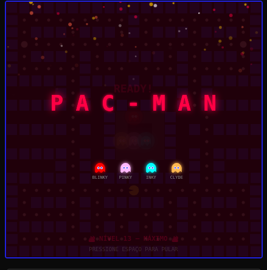
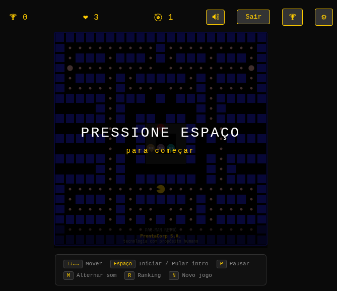
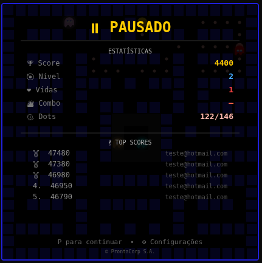
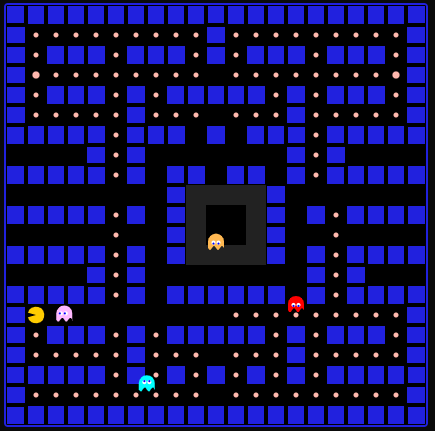
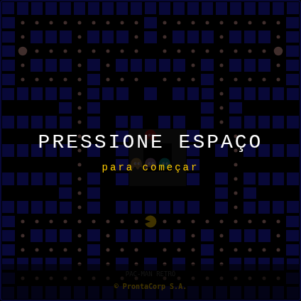
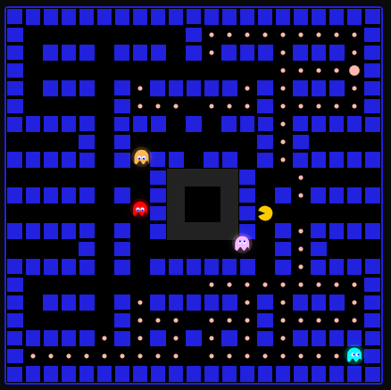
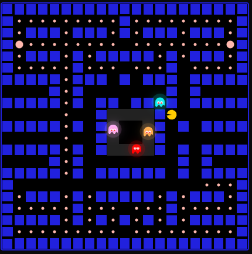
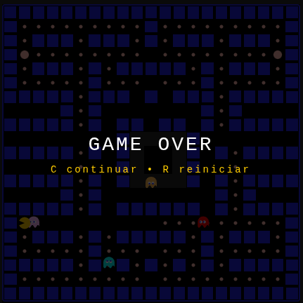

# 🟡 Pac-Man Retrô


> Uma aplicação web completa do clássico jogo Pac-Man, com backend em **Node.js + SQLite**, frontend em **HTML5 Canvas puro**, sons **sintetizados via Web Audio API**, **4 fantasmas com IA clássica**, **sistema de combos**, **controles mobile**, **menu de configurações** e **Dockerizado** para deploy rápido.

---

## 📋 Índice

- [Roadmap de Versões](#roadmap-de-versões)
- [Arquitetura](#arquitetura)
- [Funcionalidades](#funcionalidades-v22)
- [Galeria](#galeria)
- [Changelog Detalhado](#changelog-detalhado)
- [Pré-requisitos](#pré-requisitos)
- [Instalação e Execução](#instalação-e-execução)
- [Estrutura de Arquivos](#estrutura-de-arquivos)
- [API REST](#api-rest)
- [Segurança](#segurança)
- [Mecânica do Jogo](#mecânica-do-jogo)
- [IA dos Fantasmas (Tier System)](#ia-dos-fantasmas-tier-system)
- [Sons Sintetizados](#sons-sintetizados)
- [Sistema de Configurações](#sistema-de-configurações)
- [Controles Mobile](#controles-mobile)
- [Dockerização](#dockerização)
- [Variáveis de Ambiente](#variáveis-de-ambiente)
- [Licença](#licença)

---

## Roadmap de Versões

```
v0.9 (Beta)          v1.0 (Funcional)             v2.0                         v2.2 (Polish)
  │                      │                            │                           │
  ├─ 2 fantasmas         ├─ 4 fantasmas + IA          ├─ Sistema de combo         ├─ Fluidez de movimento 90°
  ├─ Movimento básico    ├─ FIX 1: Target-based       ├─ Menu de configurações    ├─ Fantasmas 3/4 saem da casa
  ├─ 100 linhas IA       ├─ FIX 2: Buffer de input    ├─ Controles mobile (D-pad) ├─ Frutas por tempo (30s)
  ├─ Sem save            ├─ FIX 3: Ghost house        ├─ Efeitos visuais por tier ├─ Salvamento automático
  ├─ Sem frutas          ├─ Scatter/Chase cycle       ├─ Tela de pausa aprimorada ├─ Botão Continue mobile
  └─ 2 sons              ├─ 4 fantasmas completos     ├─ Combo de score           ├─ Efeitos de fruta (spawn+eat)
                         ├─ Sistema de frutas         ├─ Dificuldade ajustável    ├─ Ranking modal + créditos
                         ├─ Save/resume (localStorage)├─ Intro tier-based         └─ v2.1: Mute + keyboard hints
                         ├─ Progressão de nível       ├─ 14+ sons sintetizados
                         ├─ High score + celebração   └─ Leaderboard na pausa
                         └─ 10+ sons sintetizados
```

---

## Arquitetura

```
┌─────────────────────────────────────────────────────────┐
│                     Navegador                           │
│  ┌───────────┐   ┌──────────┐   ┌────────────────────┐  │
│  │ index.html│   │ game.js  │   │ Web Audio API      │  │
│  │ (UI/Login)│   │ (Motor)  │   │ (Sons sintetizados)│  │
│  │ (D-pad)   │   │ (~2400L) │   │ (14+ efeitos)      │  │
│  │ (Settings)│   │          │   │                    │  │
│  └───────────┘   └──────────┘   └────────────────────┘  │
│         │               │                               │
│         └───────┬───────┘                               │
│                 │ fetch()                               │
└─────────────────┼───────────────────────────────────────┘
                  │
                  ▼
┌─────────────────────────────────────────────────────────┐
│                 Node.js (server.js)                     │
│  ┌──────────┐   ┌────────────┐   ┌──────────────────┐   │
│  │ Express  │   │ bcryptjs   │   │ better-sqlite3   │   │
│  │ (REST)   │   │ (hash 12)  │   │ (queries param.) │   │
│  └──────────┘   └────────────┘   └──────────────────┘   │
│                                      │                  │
│                                      ▼                  │
│                              ┌──────────────┐           │
│                              │  SQLite DB   │           │
│                              │ (users,      │           │
│                              │  sessions,   │           │
│                              │  scores)     │           │
│                              └──────────────┘           │
└─────────────────────────────────────────────────────────┘
```

### Stack

| Camada    | Tecnologia                    | Função                          |
|-----------|-------------------------------|---------------------------------|
| Frontend  | HTML5 + Canvas API + JS puro  | Jogo, sons, UI, D-pad mobile    |
| Backend   | Node.js + Express             | API REST                        |
| Banco     | SQLite (better-sqlite3)       | Persistência local              |
| Senhas    | bcryptjs (cost factor 12)     | Hash seguro                     |
| Sessão    | crypto (token aleatório 32B)  | Autenticação stateless          |
| Config    | localStorage                  | Settings, save/resume           |
| Contêiner | Docker Alpine                 | Empacotamento leve              |

---

## Funcionalidades

### 🎮 Jogo

- **Pac-Man clássico** controlado pelas setas do teclado (com buffer de direção e tolerância 10px para viradas 90°)
- **4 fantasmas** com IA clássica por tiers: Blinky, Pinky, Inky, Clyde — todos saem da casa corretamente
- **Ciclo Scatter/Chase** com timings progressivos por nível
- **Sistema de frutas** — 6 frutas (🍒🍓🍎🍉🍈🚀) com spawn a cada 30 segundos em posições aleatórias sobre pastilhas, visíveis por 30 segundos, ciclo infinito; power-ups (Speed, Shield)
- **Efeitos visuais de fruta** — brilho/pulso com partículas ao aparecer; explosão radial ao ser comida
- **Power pellets** — ativam modo fright (fantasmas azuis e vulneráveis)
- **Túneis** — wrap-around horizontal nas bordas do mapa
- **Mapa 21×21** com ghost house, portas e corredores de saída
- **Sistema de combos** — multiplicador de score por ações em sequência (ghosts + frutas)
- **Progressão de nível** — velocidade, IA e visual aumentam a cada fase
- **Save/Resume** — auto-save ao morrer, Continue/Restart no GAMEOVER, detecção no login (localStorage)
- **High Score** — submissão autenticada, tela de celebração com confete
- **Créditos** — "ProntaCorp S.A. — tecnologia com propósito humano" no footer do canvas (IDLE/PLAYING), copyright no pause/gameover, completo no ranking

### 🏆 Sistema de Combo

- Ação em sequência (ghost ou fruta) em janela de 3 segundos
- Multiplicador progressivo: x1.0 → x1.5 → x2.0 → x2.5 → ...
- Stacking com a escalação clássica de fantasmas (200 × 2^n × combo)
- Display visual: "COMBO xN.N" no canto + barra de tempo amarela
- Som de combo com pitch crescente

### ⚙️ Menu de Configurações

- **Toggle de Intro** — habilita/desabilita animação de abertura
- **Toggle de Som** — mute/unmute de todos os efeitos sonoros
- **Botão de mute rápido** 🔊/🔇 no header do jogo
- **3 níveis de dificuldade**: Fácil (0.7×), Normal (1.0×), Difícil (1.3×)
- Configurações persistem em localStorage entre sessões
- Pausa automática ao abrir, resume ao fechar

### 📱 Controles Mobile (D-Pad)

- Overlay de D-pad com 4 direções + botões START e Pause
- **Hold-to-repeat** — segurar mantém direção contínua (120ms interval)
- Compatível com touch, mouse e click (testes automatizados)
- Detecção automática via `@media (pointer: coarse)` e `max-width: 500px`
- Canvas responsivo com `max-width: 100%; height: auto`

### 👻 Efeitos Visuais por Tier

| Tier | Nível   | Efeitos |
|------|---------|---------|
| 1    | 1       | Fantasmas clássicos (sem extras) |
| 2    | 2-3     | Brilho sutil no corpo (glow aura) |
| 3    | 4-6     | Sombra pulsante, olhos com glow azul, brilho no corpo |
| 4    | 7+      | Olhos vermelhos pulsantes, afterimage (trail), glow intenso, flash na intro |

### 🎵 Áudio (Web Audio API — 14+ sons)

- **Comer pastilha** — bip ascendente (320→480 Hz)
- **Power pellet** — sawtooth ascendente (180→680 Hz)
- **Comer fantasma** — bip agudo (700→1100 Hz)
- **Comer fruta** — arpejo ascendente (520→1040 Hz)
- **Morte** — sawtooth descendente (520→40 Hz)
- **Game start** — arpejo C-E-G-C
- **Nível completo** — escala ascendente de 6 notas
- **Ready** — jingle curto entre níveis
- **Mode switch** — tom sutil para alternância scatter/chase
- **Intro** — fanfarra ascendente
- **Celebrate** — fanfarra festiva prolongada
- **Combo** — jingle com pitch crescente por nível
- **Power-up** — jingle impressivo de power-up
- Mute global via toggle nas configurações

### 🔐 Autenticação e Segurança

- **Login e registro** por e-mail + senha com bcrypt (cost 12)
- **Imune a SQL Injection** — queries parametrizadas
- **Sanitização** de inputs (remoção de XSS, limite 255 chars)
- **Validação** de formato de e-mail
- **Tokens de sessão** (32 bytes hex) em tabela separada
- **Logout** remove token do banco

### 🏅 Pause Screen Aprimorada

- Overlay canvas-renderizado com fundo escuro
- Stats ao vivo: Score, Nível, Vidas, Combo, Dots comidos/total
- Mini leaderboard: top 5 scores da API com medalhas (🥇🥈🥉)
- Destaque do score atual em dourado
- Fetch assíncrono de scores ao pausar

---

## 🖼️ Galeria

Capturas de tela do jogo em diferentes estados. Para gerar as screenshots, execute o servidor (`npm start`) e use o script `scripts/capture-screenshots.js` ou registre manualmente via DevTools.

### 🎬 Intro Animation



> Animação de abertura com título "PAC-MAN", Pac-Man comendo dots e fantasmas descendo. O visual varia por tier: partículas (tier 3+), screen shake (tier 4).

### 🎮 Gameplay



> Jogo em ação: Pac-Man navegando pelo labirinto, 4 fantasmas com IA ativa, pastilhas, power pellets e frutas visíveis. HUD mostra score, vidas e nível.

### ⏸️ Pause Screen



> Pausa canvas-renderizada com stats ao vivo (Score, Nível, Vidas, Combo, Dots) e mini leaderboard com top 5 scores da API.

### ⚙️ Settings Modal


> Menu de configurações: toggles de Intro e Som, seletor de dificuldade (Fácil/Normal/Difícil), close button.

### 📱 Mobile D-Pad


> Interface mobile responsiva: D-pad com 4 direções, botões START e Pause, canvas escalado automaticamente.

### 👻 Ghost Visual Tiers

| Tier 1 (Nível 1) | Tier 2 (Nível 2-3) | Tier 3 (Nível 4-6) | Tier 4 (Nível 7+) |
|---|---|---|---|
|  |  |  |  |
| Clássico | Glow sutil | Sombra + olhos glow | Trail + olhos vermelhos |

> Efeitos visuais progridem por tier: glow aura (tier 2+), sombra pulsante e olhos azuis (tier 3), afterimage e olhos vermelhos pulsantes (tier 4).

### 🏆 Passagem de Nível


> Tela de transição entre níveis com stats: pontuação atual, vidas restantes e fantasmas decorativos.

### 💀 Game Over



> Tela de Game Over com opções de continuar (C) ou reiniciar (N).

### 📸 Como Capturar Screenshots

```bash
# 1. Inicie o servidor
npm start

# 2. No navegador, abra DevTools (F12)
# 3. Para cada estado:
#    - Navegue até o estado desejado
#    - No Console, execute:
#      const canvas = document.getElementById('game-canvas');
#      canvas.toBlob(blob => {
#        const a = document.createElement('a');
#        a.href = URL.createObjectURL(blob);
#        a.download = 'screenshot.png';
#        a.click();
#      });
#    - Salve o arquivo na pasta screenshots/

# Ou crie um script capture-screenshots.js com Puppeteer/Playwright
# para capturar automaticamente cada estado
```

> **Nota**: As screenshots são capturadas do Canvas 2D (420×420px). Para estados com overlay (pause, settings), o canvas já inclui o render.

---

## Changelog Detalhado

### 🏷️ v0.9 — Beta (Estado Inicial)

O projeto iniciou como um protótipo básico com as seguintes limitações:

```
✅ O que existia:
  • Mapa 21×21 funcional
  • Pac-Man com movimentação por setas
  • 2 fantasmas (Blinky + Pinky) com IA básica
  • Power pellets e modo fright
  • Sistema de vidas e pontuação
  • Backend com login/registro/high scores
  • Docker básico

❌ Limitações conhecidas:
  • Movimento baseado em tileSize — flutuantes residuais
  • Input direto por keydown (sem buffer) — inputs perdidos em cruzamentos
  • Ghost house com geometria incorreta — fantasmas presos
  • Apenas 2 fantasmas (Inky e Clyde ausentes)
  • Sem scatter/chase cycle
  • Sem frutas
  • Sem save/resume
  • Sem configurações
  • Sem controles mobile
  • 2-3 sons básicos
```

### 🏷️ v1.0 — 100% Funcional

**Correções de bugs críticos (FIX 1, 2, 3):**

| Bug | Problema | Solução |
|-----|----------|---------|
| **FIX 1** | Movimento baseado em tileSize causava flutuantes residuais e movimento irregular | Reescrito como **sistema target-based**: cada entidade calcula um target (centro do próximo tile) e acumula deslocamento em direção a ele ao longo do tempo |
| **FIX 2** | Input direto por keydown perdia inputs em cruzamentos rápidos | Implementado **buffer de direção**: cada keydown enfileira uma direção (`inputQueue`), consumida uma por frame quando a entidade está alinhada ao tile |
| **FIX 3** | Ghost house tinha geometria incorreta — fantasmas não conseguiam sair | Corredor de saída em coluna 10 (linhas 8-12 → EMPTY) e corredor horizontal interno na linha 10 |

**Novas funcionalidades v1.0:**

- **4 fantasmas completos** — Inky (ciano) e Clyde (laranja) adicionados com IAs distintas
- **Ciclo Scatter/Chase** — timings progressivos por nível (7s/20s/5s/Infinity)
- **Sistema de frutas** — 6 frutas com spawn condicional ao número de dots comidos
- **Power-ups** — Speed (1.5× velocidade, 5s) e Shield (invencível, 4s)
- **Save/Resume** — auto-save em pause/nível completo, restauração com `resumeGame()`
- **Progressão de nível** — tabela de velocidades por nível, escalonamento de dificuldade
- **Túneis** — wrap-around horizontal funcional
- **High Score** — tela de celebração com confete para top 10
- **Intermissão** — tela entre níveis com stats e fantasmas decorativos
- **10+ sons** — gameStart, eatFruit, powerUp, levelComplete, ready, modeSwitch, intro

### 🏷️ v2.0 — Features Premium

**Sistema de Combo:**
- Contador unificado para ghosts e frutas com janela de 3 segundos
- Multiplicador: `1 + (count - 1) × 0.5` → x1.0, x1.5, x2.0, x2.5, ...
- Stacking com ghost chain (200 × 2^n × comboMultiplier)
- Display visual com barra de tempo e fade-out
- Som de combo com pitch crescente

**Menu de Configurações:**
- Modal overlay com toggles de intro/sound e seletor de dificuldade
- 3 presets: Fácil (0.7×), Normal (1.0×), Difícil (1.3×)
- Botão de mute rápido 🔊/🔇 no header + atalho tecla M
- Validação de settings: dificuldade inválida no localStorage reseta para 'normal'
- Persistência em localStorage, reload automático
- Pausa/resume ao abrir/fechar

**Controles Mobile (D-Pad):**
- Overlay com 4 botões de direção + START + Pause
- Hold-to-repeat (setInterval 120ms com cleanup adequado)
- Debounce (300ms) para evitar triple-fire (touchstart+mousedown+click)
- Detecção automática mobile via CSS media queries
- Canvas responsivo

**Tela de Pausa Aprimorada:**
- Canvas-renderizado (não HTML overlay)
- Stats ao vivo: Score, Nível, Vidas, Combo, Dots
- Mini leaderboard: top 5 com medalhas e destaque do score atual
- Fetch assíncrono de scores

**Efeitos Visuais por Tier:**
- 4 tiers baseados no nível (1/2-3/4-6/7+)
- Glow aura progressivo no corpo dos fantasmas
- Sombra pulsante (tier 3+)
- Afterimage/trail nos fantasmas (tier 4)
- Olhos vermelhos pulsantes (tier 4)
- Olhos com glow azul (tier 3)
- Flash e screen shake na intro (tier 4)

**Sons adicionais:**
- Combo (pitch crescente por nível)
- Celebrate (fanfarra festiva prolongada)
- Ready (jingle entre níveis)
- Mode switch (tom sutil)

### 🏷️ v2.1 — Bug Fixes, Mute Button, Keyboard Hints

**Correções e melhorias:**

- Botão 🔊/🔇 de mute rápido no header + atalho M
- Seção de dicas de teclado no HTML
- Teclas não vazam na tela de Auth
- Nível "Extremo" removido (3 dificuldades: Fácil, Normal, Difícil)
- Sons `powerPellet()` e `death()` agora respeitam mute
- `_loadSettings()` valida dificuldade no localStorage

### 🏷️ v2.2 — Polimento e Correções Críticas

**Correções de bugs:**

- **Fluidez de movimento 90°** — `TURN_TOLERANCE` aumentado para 10px; detecção antecipada de cruzamento
- **Fantasmas 3 e 4 saindo da casa** — navega horizontalmente até coluna 10 antes de subir
- **Sistema de frutas** — timer de 30 segundos, spawn aleatório sobre pastilhas, ciclo infinito, ordem progressiva
- **Salvamento automático** — auto-save ao morrer, Continue/Restart no GAMEOVER, detecção no login

**Novas funcionalidades:**

- **Efeitos visuais de fruta** — brilho/pulso com partículas ao aparecer; explosão radial ao comer
- **Botão Continue mobile** — botão verde "▶ CONT" no GAMEOVER com save
- **Tela de créditos** — "© ProntaCorp S.A." no estado IDLE
- **Frutas reordenadas** — 🍒→🍓→🍎→🍉→🍈→🚀 (cereja, morango, maçã, melancia, melão, foguete)

---

## Pré-requisitos

- **Node.js** 20+ (para execução local)
- **Docker** + **Docker Compose** (para execução conteinerizada)
- Navegador moderno (Chrome, Firefox, Edge) — necessário para Web Audio API
- Para testes mobile: dispositivo com tela touch ou DevTools mobile

---

## Instalação e Execução

### Local (sem Docker)

```bash
# 1. Clone o repositório
git clone https://github.com/seu-usuario/pacman-app.git
cd pacman-app

# 2. Instale as dependências
npm install

# 3. Execute o servidor
npm start

# 4. Acesse no navegador
#    → http://localhost:3000
```

O banco SQLite será criado automaticamente em `./data/pacman.db`.

### Com Docker

```bash
# 1. Build e execute com Docker Compose
docker compose up -d --build

# 2. Acesse no navegador
#    → http://localhost:3001

# Para parar:
docker compose down
```

O banco de dados será persistido em `./pacman-data/production.db` no host.

---

## Estrutura de Arquivos

```
pacman-app/
├── package.json          # Dependências e scripts
├── server.js             # Servidor Express + SQLite + API
├── public/
│   ├── index.html        # Interface HTML (login + jogo + D-pad + settings modal)
│   └── game.js           # Motor completo do Pac-Man (~2400 linhas)
├── screenshots/          # Capturas de tela do jogo
│   ├── 01-intro.png
│   ├── 02-gameplay.png
│   ├── 03-pause.png
│   ├── 04-settings.png
│   ├── 06-auth.png
│   ├── 07-levelup.png
│   └── 08-gameover.png
├── Dockerfile            # Build da imagem Node Alpine
├── docker-compose.yml    # Orquestração do contêiner
└── pacman-data/          # (criado automaticamente) Banco SQLite persistido
```

---

## API REST

Toda a API é servida em `http://localhost:PORT/api/`.

### Autenticação

| Método | Rota             | Corpo                         | Resposta                    |
|--------|------------------|-------------------------------|-----------------------------|
| POST   | `/api/register`  | `{ email, password }`         | `{ token, email }`          |
| POST   | `/api/login`     | `{ email, password }`         | `{ token, email }`          |
| POST   | `/api/logout`    | — (Bearer token)              | `{ ok: true }`              |
| GET    | `/api/me`        | — (Bearer token)              | `{ id, email, created_at }` |

### Pontuação

| Método | Rota            | Autenticação | Corpo/Query     | Resposta                              |
|--------|-----------------|--------------|-----------------|---------------------------------------|
| GET    | `/api/scores`   | ❌            | `?limit=10`     | `[{score, player_email, created_at}]` |
| POST   | `/api/scores`   | ✅ Bearer     | `{ score }`     | `{ ok: true }`                        |

> **Exemplo de requisição autenticada:**
> ```http
> POST /api/scores
> Authorization: Bearer <seu-token>
> Content-Type: application/json
>
> { "score": 12500 }
> ```

### Códigos de Erro

| Status | Significado                    |
|--------|--------------------------------|
| 400    | Dados inválidos (e-mail, senha, score) |
| 401    | Token ausente ou inválido      |
| 409    | E-mail já cadastrado           |
| 500    | Erro interno do servidor       |

---

## Segurança

### SQL Injection — Zero

Todas as queries usam **prepared statements** do `better-sqlite3`:

```javascript
// ❌ NUNCA — vulnerável a SQL Injection
db.run(`SELECT * FROM users WHERE email = '${email}'`);

// ✅ SEMPRE — queries parametrizadas
db.prepare('SELECT * FROM users WHERE email = ?').get(email);
```

### Senhas — bcrypt com cost factor 12

```javascript
const hash = bcrypt.hashSync(password, 12);       // ~250ms por hash
const match = bcrypt.compareSync(password, hash);  // verificação segura
```

### Sanitização de Inputs

```javascript
function sanitize(v) {
  if (typeof v !== 'string') return '';
  return v.trim().replace(/[<>&'"]/g, '').slice(0, 255);
}
```

### Tokens de Sessão

```javascript
const token = crypto.randomBytes(32).toString('hex');  // 64 caracteres hex
// Armazenado em tabela separada com FK para users
// Removido no logout
```

---

## Mecânica do Jogo

### Mapa

O mapa é uma matriz **21×21** onde cada célula representa um tile de 20×20 pixels (canvas 420×420):

| Valor | Tile            | Descrição                            |
|-------|-----------------|--------------------------------------|
| 0     | `EMPTY`         | Caminho vazio                        |
| 1     | `WALL`          | Parede (intransponível)              |
| 2     | `DOT`           | Pastilha (+10 pontos)                |
| 3     | `POWER`         | Power pellet (+50 pontos)            |
| 4     | `GHOUSE`        | Parede da ghost house (só fantasmas) |
| 5     | `DOOR`          | Porta da ghost house (só fantasmas)  |

### Entidades

**Pac-Man:**
- Velocidade base: 5.5 tiles/s (+0.2 por nível)
- Movimento **target-based** — calcula centro do próximo tile e interpola
- **Buffer de direção** — keydown enfileira, executada no próximo cruzamento
- Colisão com fantasma = perde vida (exceto durante fright ou shield)

**Fantasmas (4 com IAs distintas):**

| Fantasma | Cor   | IA Clássica |
|----------|-------|-------------|
| **Blinky** (vermelho) | `#ff0000` | Persegue tile do Pac-Man (antecipação crescente por tier) |
| **Pinky** (rosa) | `#ffb8ff` | Mira N tiles à frente do Pac-Man (flanco em tier 4) |
| **Inky** (ciano) | `#00ffff` | Usa Blinky como referência com pivot (complexo) |
| **Clyde** (laranja) | `#ffb851` | Persegue quando longe, scatter quando perto |

### Máquina de Estados

```
IDLE ──(Espaço)──► READY ──(2s)──► PLAYING ──(morte)──► DYING ──(1.5s)──┐
                                                              │              │
                                              lives > 0 ──────┘     lives = 0
                                                     │                   │
                                                   READY              GAMEOVER
                                                                          │
                                                                    (Espaço) → IDLE

PLAYING ──(todos dots)──► WIN ──(2s)──► INTERMISSION ──(3s)──► startLevel()

PLAYING ──(P)──► PAUSED ──(P)──► PLAYING
              │
              └── settings-btn → PAUSED → settings-modal
```

### Pontuação

| Ação                          | Pontos               |
|-------------------------------|----------------------|
| Pastilha comum                | 10                   |
| Power pellet                  | 50                   |
| 1º fantasma (fright)          | 200                  |
| 2º fantasma (mesmo PP)        | 400                  |
| 3º fantasma (mesmo PP)        | 800                  |
| 4º fantasma (mesmo PP)        | 1.600                |
| 🍒 Cherry                     | 100                  |
| 🍓 Morango                    | 300                  |
| 🍎 Maçã                       | 500                  |
| 🍉 Melancia                   | 700                  |
| 🍈 Melão (Speed Up)           | 1.000                |
| 🚀 Foguete (Shield)           | 2.000                |

> Todos os valores acima são **multiplicados pelo combo multiplier** quando aplicável.

### Sistema de Combo

```
Ação → comboCount++ → comboTimer = 3s → comboMultiplier = 1 + (count-1) × 0.5

Exemplos:
  1ª ação:  ×1.0  (base)
  2ª ação:  ×1.5
  3ª ação:  ×2.0
  4ª ação:  ×2.5
  5ª ação:  ×3.0
  ...
```

O combo funciona para **fantasmas e frutas** — comer qualquer um deles na janela de 3 segundos incrementa o multiplicador. Stacking com a escalação clássica de fantasmas (200 × 2^n) cria scores massivos no late game.

### Power-ups

| Power-up | Emoji | Duração | Efeito |
|----------|-------|---------|--------|
| Speed Up | 🍈 | 5s | Velocidade do Pac-Man ×1.5 |
| Shield   | 🚀 | 4s | Invencível (ignora colisão com fantasmas) |

---

## IA dos Fantasmas (Tier System)

O jogo implementa um sistema de **4 tiers** de dificuldade baseado no nível:

| Tier | Nível | Scatter reduzido | Blinky Ahead | Pinky Ahead | Inky Pivot | Clyde Threshold | Coordenação |
|------|-------|------------------|-------------|-------------|------------|-----------------|-------------|
| 1    | 1     | Não              | 0           | 4           | 2          | 8 tiles         | Não         |
| 2    | 2-3   | Não              | 1           | 5           | 3          | 6 tiles         | Não         |
| 3    | 4-6   | Scatter ÷ 2      | 2           | 6           | 3          | 4 tiles         | Flanco      |
| 4    | 7+    | Scatter ÷ 2      | 3           | 7           | 4          | 0 (sempre chase)| Coordenação |

**Comportamento por tier:**
- **Tier 1**: Comportamento clássico básico
- **Tier 2**: Fantasmas antecipam movimentos do Pac-Man
- **Tier 3**: Scatter phases são mais curtos (fantasmas perseguem mais), Inky usa posição antecipada de Blinky
- **Tier 4**: Blinky ignora scatter, Pinky calcula flanco quando Pac-Man está perto, Clyde mira posição futura

### Velocidades por Nível

| Nível | Pac-Man | Blinky | Pinky | Inky | Clyde |
|-------|---------|--------|-------|------|-------|
| 1     | 5.5     | 5.0    | 5.0   | 5.0  | 5.0   |
| 2     | 5.7     | 5.4    | 5.2   | 5.1  | 5.1   |
| 3     | 5.9     | 5.7    | 5.4   | 5.3  | 5.2   |
| 4     | 6.1     | 6.0    | 5.6   | 5.5  | 5.3   |
| 5     | 6.3     | 6.3    | 5.8   | 5.7  | 5.4   |
| 6-7   | 6.5     | 6.5    | 6.0   | 5.9  | 5.5   |
| 8-9   | 6.8     | 6.8    | 6.2   | 6.1  | 5.7   |
| 10-11 | 7.0     | 7.0    | 6.5   | 6.3  | 5.9   |
| 12-13 | 7.2     | 7.2    | 6.7   | 6.5  | 6.1   |
| 14+   | 7.5     | 7.5    | 7.0   | 6.7  | 6.3   |

> Valores em tiles/segundo. Multiplicador de dificuldade (config) é aplicado sobre as velocidades dos fantasmas.

---

## Sons Sintetizados

Todos os sons são gerados em tempo real pela **Web Audio API**, sem arquivos externos.

| Efeito          | Oscilador | Frequência              | Duração   | Onde toca              |
|-----------------|-----------|-------------------------|-----------|------------------------|
| Chomp           | Square    | 320 → 480 Hz            | 60 ms     | Comer pastilha         |
| Power pellet    | Sawtooth  | 180 → 680 Hz            | 350 ms    | Comer power pellet     |
| Eat ghost       | Square    | 700 → 1100 Hz           | 200 ms    | Comer fantasma (fright)|
| Eat fruit       | Sine      | 520 → 1040 Hz           | 240 ms    | Comer fruta            |
| Death           | Sawtooth  | 520 → 40 Hz             | 1.0 s     | Pac-Man morre          |
| Game start      | Square    | 260, 330, 390, 520      | 720 ms    | Iniciar jogo           |
| Level complete  | Square    | 6 notas ascendentes     | 660 ms    | Completar nível        |
| Ready           | Triangle  | 440, 550, 660           | 300 ms    | Tela READY             |
| Mode switch     | Sine      | 330, 440                | 140 ms    | Scatter ↔ Chase        |
| Intro           | Square    | 6 notas ascendentes     | 900 ms    | Animação de abertura   |
| Celebrate       | Square    | 8 notas + brilhantes    | 1.5 s     | High score             |
| Combo           | Square    | Pitch por nível         | 150 ms    | Combo multiplier       |
| Power-up        | Square    | 5 notas ascendentes     | 350 ms    | Ativar power-up        |

> ℹ️ O `AudioContext` é criado na primeira interação do usuário (autoplay policy dos navegadores). Todos os sons podem ser mutados pelo toggle de som nas configurações.

---

## Sistema de Configurações

Configurações são persistidas em `localStorage` com a chave `pacman_settings`.

### Estrutura

```javascript
{
  introEnabled: true,    // Toggle de animação de intro
  soundEnabled: true,    // Toggle global de som (Audio._muted)
  difficulty: 'normal'   // 'easy' | 'normal' | 'hard' | 'extreme'
}
```

### Multiplicadores de Dificuldade

| Dificuldade | Multiplicador | Efeito |
|-------------|---------------|--------|
| 🟢 Fácil     | 0.7×          | Fantasmas 30% mais lentos |
| 🟡 Normal    | 1.0×          | Velocidade padrão |
| 🟠 Difícil   | 1.3×          | Fantasmas 30% mais rápidos |

> ℹ️ Validação: se uma dificuldade inválida estiver salva no localStorage (ex: 'extreme' de versão anterior), é automaticamente resetada para 'normal'.

### Integração com o Jogo

- **Intro**: `init()` e `startLevel()` verificam `settings.introEnabled` antes de iniciar animação
- **Som**: `Audio._muted` é sincronizado a cada frame com `settings.soundEnabled`
- **Velocidade**: `g.baseSpeed × _getDifficultyMultiplier()` aplicado nos fantasmas durante PLAYING

---

## Controles Mobile

### D-Pad Overlay

```html
<div id="mobile-controls">
  <div class="dpad">
    <button class="dpad-btn" data-dir="up">▲</button>
    <button class="dpad-btn" data-dir="left">◄</button>
    <div class="dpad-center"></div>
    <button class="dpad-btn" data-dir="right">►</button>
    <button class="dpad-btn" data-dir="down">▼</button>
  </div>
  <div class="action-buttons">
    <button id="mobile-start">START</button>
    <button id="mobile-pause">⏸</button>
  </div>
</div>
```

### Comportamento

- **Hold-to-repeat**: segurar uma direção dispara `inputQueue.push()` a cada 120ms
- **Debounce (300ms)**: previne triple-fire de touchstart + mousedown + click
- **Cleanup**: interval é limpo em touchend, touchcancel, mouseup e mouseleave
- **START**: trata IDLE (novo jogo/continuar), GAMEOVER (init), INTRO (pular)
- **Pause**: alterna entre PLAYING ↔ PAUSED
- **Continue**: botão verde "▶ CONT" aparece no GAMEOVER quando há save disponível

### Detecção Automática

```css
@media (pointer: coarse), (max-width: 500px) {
  #mobile-controls { display: flex; }
  #game-canvas { max-width: 100%; height: auto; }
}
```

---

## Dockerização

### Dockerfile

```dockerfile
FROM node:20-alpine
WORKDIR /app
COPY package*.json ./
RUN npm install --production && npm cache clean --force
COPY . .
EXPOSE 3000
CMD ["node", "server.js"]
```

Base **Alpine Linux** (~120 MB de imagem final).

### Docker Compose

```yaml
services:
  pacman:
    build: .
    environment:
      - PORT=3001
      - DB_PATH=/opt/pacman-data/production.db
    ports:
      - "3001:3000"
    volumes:
      - ./pacman-data:/opt/pacman-data
```

**Comportamento:**
- Banco SQLite em `/opt/pacman-data/production.db` dentro do contêiner
- Volume bind para `./pacman-data/` no host → dados persistem entre execuções
- Porta 3001 no host mapeada para 3000 no contêiner

---

## Variáveis de Ambiente

| Variável    | Padrão                          | Descrição                    |
|-------------|---------------------------------|------------------------------|
| `PORT`      | `3000`                          | Porta do servidor            |
| `DB_PATH`   | `./data/pacman.db`              | Caminho do arquivo SQLite    |

### Configuração

```bash
# Linux / macOS
export PORT=3000
export DB_PATH=/caminho/personalizado/pacman.db
npm start

# Windows (CMD)
set PORT=3000
set DB_PATH=C:\dados\pacman.db
npm start

# Windows (PowerShell)
$env:PORT=3000
$env:DB_PATH="C:\dados\pacman.db"
npm start
```

---

## Controles

| Tecla         | Ação                                    |
|---------------|-----------------------------------------|
| ← → ↑ ↓      | Mover Pac-Man (buffer de direção com tolerância 10px)  |
| Espaço        | Iniciar jogo / Pular intro / Continuar                  |
| P             | Pausar / Retomar                                        |
| N             | Novo jogo (ignora save) — funciona em IDLE e GAMEOVER  |
| C             | Continuar jogo salvo (GAMEOVER com save)                |
| R             | Abrir ranking (IDLE, Pausa e Game Over)                 |
| M             | Alternar som (mute/desmute)                             |
| ⚙️ (botão)     | Abrir configurações                                     |
| 🔊/🔇 (botão) | Alternar som rápido no header                           |

---

## Possíveis Melhorias Futuras

- [ ] **Multiplayer/WebSockets** — modo competitivo ou espectador ao vivo
- [ ] **Temas de mapa** — mapas alternativos selecionáveis
- [ ] **Leaderboard global** — página dedicada com histórico completo e filtros
- [ ] **Mais frutas e power-ups** — novos tipos com efeitos únicos
- [ ] **Achievements/Sistema de conquistas** — marcos desbloqueáveis
- [ ] **Animações de abertura personalizáveis** — temos o sistema de tiers pronto

---

## Licença

Este projeto é licenciado sob a [MIT License](LICENSE).

**Pac-Man** é propriedade registrada da Bandai Namco Entertainment. Este é um projeto **educacional/fan-made** sem fins comerciais. Inspirado no clássico original de 1980 por Tōru Iwatani.
